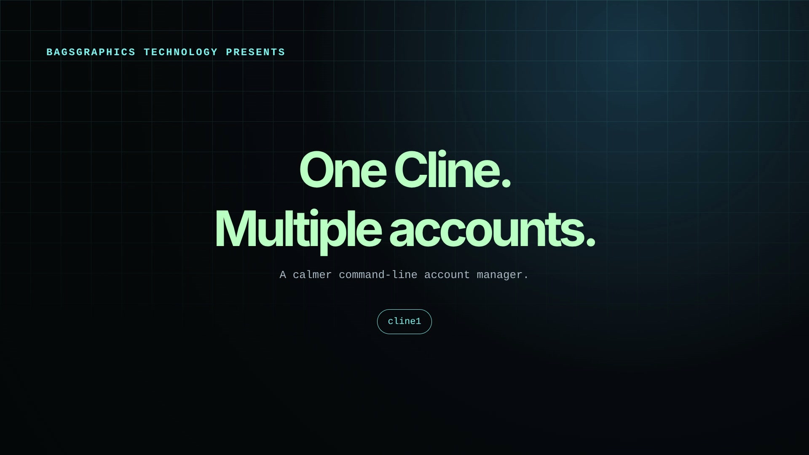
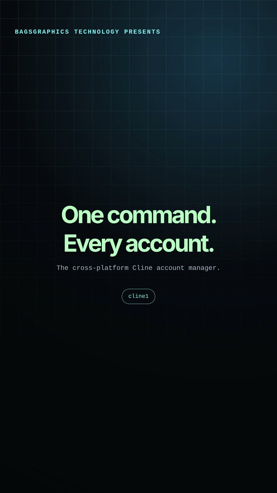

# cline1

A cross-platform account manager for the [Cline CLI](https://www.npmjs.com/package/cline).

`cline1` gives people who use multiple Cline accounts one focused command for:

1. **New login** — preserve the current session and start Cline authentication.
2. **Switch account** — restore a saved local account and launch Cline.
3. **Delete account** — remove a local saved login after confirmation.

> **Local-account safety:** Delete removes the local login file on your device. It does not delete the account from Cline's servers. Cline may store access and refresh tokens locally, so account files should never be committed or shared.

## Demo

### Presentation demo



<video controls width="100%" preload="metadata" poster="./assets/cline1-presentation.jpg">
  <source src="./assets/cline1-presentation.mp4" type="video/mp4">
  Your browser does not support embedded video. <a href="./assets/cline1-presentation.mp4">Download the presentation demo</a>.
</video>

[Download the presentation video](./assets/cline1-presentation.mp4)

### Social demo



<video controls width="100%" preload="metadata" poster="./assets/cline1-social.jpg">
  <source src="./assets/cline1-social.mp4" type="video/mp4">
  Your browser does not support embedded video. <a href="./assets/cline1-social.mp4">Download the social demo</a>.
</video>

[Download the social video](./assets/cline1-social.mp4)

## Why cline1?

Cline stores provider authentication in a local settings file. When one person uses more than one Cline account, switching manually can mean moving, renaming, and restoring sensitive local files.

`cline1` keeps that process simple and repeatable:

- It checks **Node.js first**.
- It checks **Cline CLI second**.
- It opens the account manager only after those checks pass.
- It creates timestamped local backups with restricted permissions on Unix-like systems.
- It runs on Linux, macOS, and Windows.

## Install

### Linux and macOS

Run one command:

```bash
git clone https://github.com/Boatengadams/cline1.git cline1 && cd cline1 && chmod +x cline1 install.sh && ./install.sh
```

The installer checks for Node.js, offers to install it when needed, copies `cline1` to `~/.local/bin`, and updates your Bash/Zsh `PATH` automatically when necessary.

Open a new terminal, then run:

```bash
cline1
```

### Windows PowerShell

Run one command:

```powershell
git clone https://github.com/Boatengadams/cline1.git cline1; Set-ExecutionPolicy -Scope Process Bypass; cd cline1; .\install.ps1
```

The installer checks for Node.js, offers to install it with `winget` when available, copies the command to `%LOCALAPPDATA%\cline1\bin`, and updates your user `PATH`.

Close and reopen PowerShell or Command Prompt, then run:

```powershell
cline1
```

Node.js is required because Cline CLI is distributed through npm. Download it from [nodejs.org](https://nodejs.org/) if necessary.

## Use

From any directory, run:

```bash
cline1
```

The interactive menu is:

```text
Choose an option:
  1) New login (save the current account first)
  2) Switch account
  3) Delete account
  4) Exit
```

Useful options:

```bash
cline1 --check     # Check whether Cline CLI is installed
cline1 --list      # List locally saved accounts
cline1 --help      # Show command help
```

## What each action does

### New login

`cline1` copies the current `providers.json` to a timestamped backup, removes the active local login, and starts:

```bash
cline auth cline
```

The previous account remains available as a backup.

### Switch account

`cline1` lists the saved accounts, preserves the active session, restores the selected account atomically, and starts Cline.

### Delete account

`cline1` shows active and saved accounts and asks for confirmation before deleting a local login. It never deletes the remote Cline account.

## Account storage

The active Cline account normally lives at:

```text
~/.cline/data/settings/providers.json
```

On Windows, this is typically:

```text
C:\Users\<your-user>\.cline\data\settings\providers.json
```

Backups use names such as:

```text
providers.json.backup.YYYYMMDD-HHMMSS-12345
```

On Linux and macOS, backup files are created with user-only permissions (`600`). Do not upload `providers.json` or any `providers.json.backup.*` file.

## Project structure

```text
cline1/
├── cline1              # Linux/macOS launcher
├── cline1-app.js       # Cross-platform Node.js account manager
├── cline1.cmd          # Windows launcher
├── install.sh          # Linux/macOS installer
├── install.ps1         # Windows PowerShell installer
├── assets/             # Demo posters and videos
├── README.md
└── .gitignore
```

## Security before publishing

The `.gitignore` excludes common Cline account files and temporary files. Review changes before sharing:

```bash
git status --short
git diff --cached
```

Never publish:

```text
providers.json
providers.json.backup.*
```

## Contributing

Issues and pull requests are welcome. Please do not include real `providers.json` files, access tokens, refresh tokens, or other authentication data in issues or pull requests.

## License

No license has been selected yet. Add a license before distributing the project as an official open-source release.

---

**Built by BAGSGRAPHICS TECHNOLOGY.**
